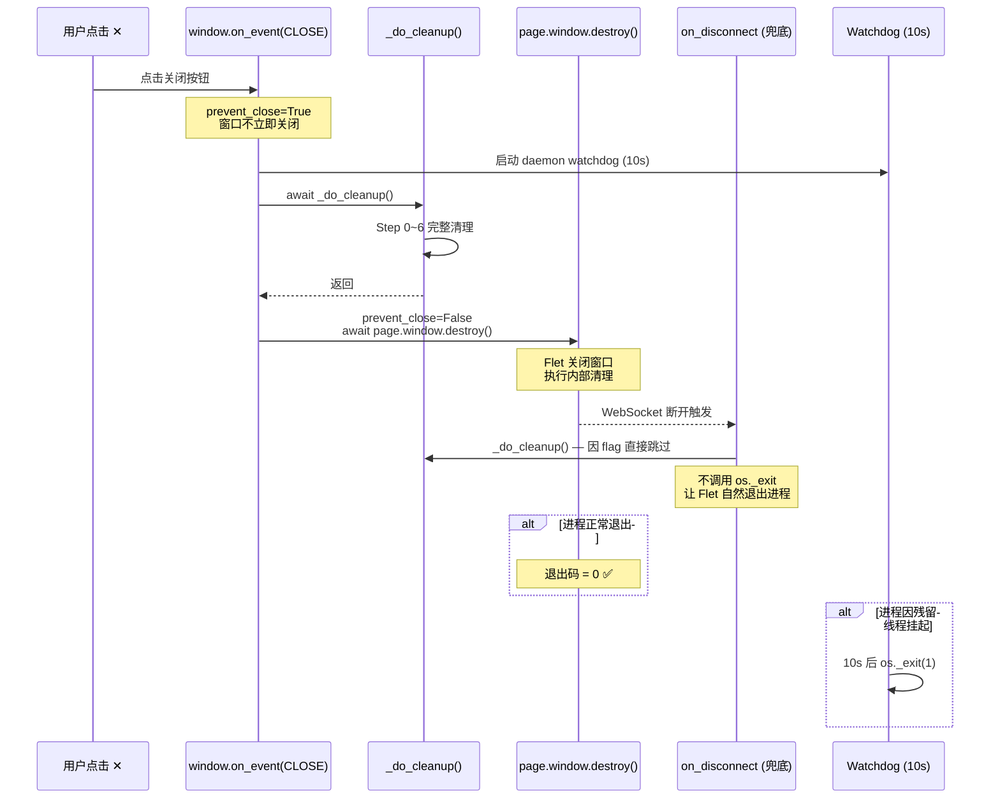
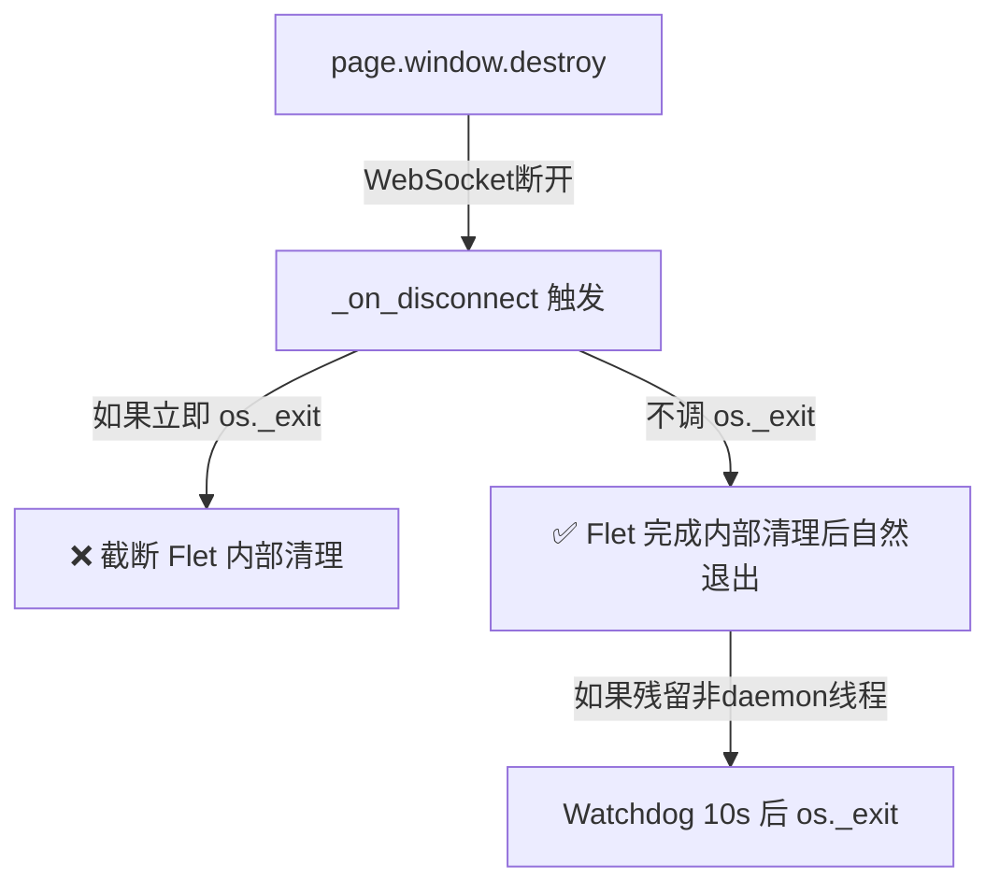

# 致命缺陷一修复：优雅退出全链路重构 (v2 — 自审修订)

## v1 → v2 修订说明

> [!CAUTION]
> 我在 v1 方案中发现了 **5 个关键错误**，以下是逐条纠正。

| # | v1 中的错误 | 影响 | v2 修正 |
|---|------------|------|---------|
| **A** | `DatabaseManager().close()` — 但 DatabaseManager **不是单例**！每次 `DatabaseManager()` 都会创建新实例，`_engine=None`，`close()` 是空操作 | Step 5 做了无用功，真正的 DB 引擎（由 `DataExplorerView` 持有）没有被关闭 | **删除 Step 5**。原因：①该引擎是 SQLite/PG 同步连接，进程退出后 OS 自动回收 fd/socket；②PG 服务端通过 TCP keepalive 自行检测断连。如确需关闭，需先将 DatabaseManager 改造为单例（属于独立 PR） |
| **B** | `_on_disconnect` 兜底中直接调 `os._exit(0)` | 在正常路径中，`page.window.destroy()` → WebSocket 断开 → `_on_disconnect` **立即触发** → `os._exit(0)` 截断 Flet 自身的内部清理流程 | `_on_disconnect` 中 **不再调用 `os._exit`**，仅做 `_do_cleanup()`。进程退出完全依赖 Flet 自然退出 + watchdog 兜底 |
| **C** | `CacheManager().close()` 被调用两次 | `dp.close()` 内部已调用 `cache.close()`，Step 4.5 再调会对已 dispose 的 engine 操作，可能抛异常 | **已在 v1 中移除 Step 4.5**，保持 |
| **D** | `dp.close()` 内部冗余调用 `dp.stop()` + 额外 `sleep(1.0)` | Step 2 已调用 `dp.stop()`，Step 4 的 `dp.close()` 又调一次（幂等但无用），且多等 1 秒 | 不改动 `DataProcessor.close()` 的内部逻辑（那是独立重构范围），但在方案中明确标注总耗时预算 |
| **E** | 未考虑引导向导期间关闭的边界情况 | 用户在 OnboardingWizard 阶段关闭窗口时，各服务从未启动。`DataProcessor()` 首次构造时 `CacheManager.engine=None`，`dp.close()` → `cache.close()` → `self.engine.dispose()` 会 `AttributeError` | `_do_cleanup` 中对 `dp.close()` 添加 engine 存在性检查 |

---

## 问题背景

当前 `main.py` 在 `cleanup_resources` 中使用 `sys.exit(0)` 终止进程。但因为该函数是 `async def`，`SystemExit` 被 asyncio Task 机制捕获，进程**不会退出**。最终由 5 秒 watchdog 以 `os._exit(1)`（错误码=1）强杀。

## 系统中持有后台资源的完整组件清单

| # | 组件 | 资源类型 | 当前 cleanup 处理 | 状态 |
|---|------|----------|------------------|------|
| 1 | **ThreadPoolManager** | 2× ThreadPoolExecutor（IO+CPU），非daemon线程 | Step 5: `shutdown(wait=False)` | ✅ |
| 2 | **SchedulerService** | APScheduler AsyncIOScheduler | Step 1: `scheduler.stop()` | ✅ |
| 3 | **NewsSubscriptionService** | 多个 asyncio.Task | Step 1: `stop()` | ⚠️ `_background_tasks` 中的 fire-and-forget task 未全部 cancel |
| 4 | **MarketDataService** | 单个 asyncio.Task | Step 1: `stop()` | ✅ |
| 5 | **DataProcessor** | cancel_event + strategies | Step 2: `stop()` + Step 4: `close()` | ✅ |
| 6 | **CacheManager (异步引擎)** | AsyncEngine 连接池 | Step 4: `dp.close()` → `cache.close()` | ✅（已去除重复调用） |
| 7 | **DatabaseManager (同步引擎)** | Engine 连接池（Data Explorer） | ❌ 未处理 | 🟡 不影响：进程退出 OS 回收 |
| 8 | **LocalModelManager** | Llama.cpp 模型（数GB内存） | ❌ 未处理 | 🟡 新增 Step 5 卸载 |
| 9 | **TaskManager** | asyncio.Tasks + loop 引用 | Step 0: `cancel_all_running_async()` | ✅ |

## 修改后退出流程



---

## 具体代码修改

### [MODIFY] [main.py](file:///d:/workspace/Quantitative%20Trading/astock_screener/main.py)

替换第 35~121 行（`cleanup_resources` 函数及其绑定）为：

```python
    # ============================================================
    # 退出清理逻辑
    # ============================================================
    _cleanup_done = False  # 防重入标志

    async def _do_cleanup():
        """
        核心清理逻辑。停止所有后台服务，关闭数据库连接，释放线程池。
        不包含任何退出语句（sys.exit/os._exit），由调用方决定退出方式。
        幂等：通过 _cleanup_done 标志保证只执行一次。
        """
        nonlocal _cleanup_done
        if _cleanup_done:
            logger.info("[Main] Cleanup already completed, skipping.")
            return
        _cleanup_done = True

        logging.getLogger("asyncio").setLevel(logging.ERROR)
        logger.info("[Main] ========== Cleanup initiated ==========")

        try:
            # Step 0: 取消所有 TaskManager 管理的异步任务
            logger.info("[Main] Step 0: Cancelling all TaskManager tasks...")
            from services.task_manager import TaskManager
            await TaskManager().cancel_all_running_async()

            # Step 1: 停止后台轮询服务
            logger.info("[Main] Step 1: Stopping background services...")
            logger.info("[Main]   - Scheduler")
            scheduler.stop()
            logger.info("[Main]   - NewsSubscriptionService")
            NewsSubscriptionService().stop()
            logger.info("[Main]   - MarketDataService")
            MarketDataService().stop()

            # 留出时间让 asyncio Task 响应取消信号
            await asyncio.sleep(1.0)

            # Step 2: 发出全局取消信号（DataProcessor + Strategies）
            logger.info("[Main] Step 2: Signaling global cancellation...")
            from data.data_processor import DataProcessor
            dp = DataProcessor()
            await dp.stop()

            # Step 3: 停止 Toast Manager
            logger.info("[Main] Step 3: Stopping Toast Manager...")
            if hasattr(page, "toast") and page.toast:  # type: ignore
                try:
                    import inspect
                    if hasattr(page.toast, "stop_all"):  # type: ignore
                        res = page.toast.stop_all()  # type: ignore
                        if inspect.isawaitable(res):
                            await res
                except Exception as ex:
                    logger.warning(f"[Main] Toast cleanup failed (non-critical): {ex}")

            # Step 4: 关闭异步数据库引擎
            # dp.close() 内部调用 cache.close()，不再单独重复调
            logger.info("[Main] Step 4: Closing async DB engine...")
            if dp.cache and dp.cache.engine is not None:
                await dp.close()
                logger.info("[Main]   DB engine disposed.")
            else:
                logger.info("[Main]   DB engine was never created, skipping.")

            # Step 5: 卸载本地 AI 模型（释放内存/显存）
            logger.info("[Main] Step 5: Unloading local AI model...")
            try:
                from services.local_model_manager import LocalModelManager
                if LocalModelManager._instance is not None and LocalModelManager._instance._llm is not None:
                    LocalModelManager._instance.unload_model()
            except Exception:
                pass

            # Step 6: 关闭线程池（最后执行，因前面步骤可能依赖它）
            logger.info("[Main] Step 6: Shutting down Thread Pools...")
            from utils.thread_pool import ThreadPoolManager
            ThreadPoolManager().shutdown(wait=False)

        except Exception as ex:
            logger.error(f"[Main] Error during cleanup: {ex}", exc_info=True)

        logger.info("[Main] ========== All resources released ==========")

        # 刷写所有日志 handler
        for handler in logging.root.handlers:
            try:
                handler.flush()
            except Exception:
                pass

    # ---- watchdog 工具函数 ----
    _watchdog_started = False

    def _start_watchdog(timeout_s=10):
        """启动守护看门狗。幂等，只启动一次。"""
        nonlocal _watchdog_started
        if _watchdog_started:
            return
        _watchdog_started = True

        import os
        import threading

        def _force_exit():
            import time
            time.sleep(timeout_s)
            logger.warning(f"[Main] Watchdog timeout ({timeout_s}s) — forcing exit.")
            os._exit(1)

        threading.Thread(target=_force_exit, daemon=True).start()
        logger.info(f"[Main] Watchdog started ({timeout_s}s).")

    # ---- 主退出路径：拦截窗口关闭事件（窗口关闭之前触发） ----
    page.window.prevent_close = True

    async def _on_window_event(e):
        if e.type == ft.WindowEventType.CLOSE:
            _start_watchdog(10)
            await _do_cleanup()
            page.window.prevent_close = False
            await page.window.destroy()

    page.window.on_event = _on_window_event

    # ---- 兜底路径：WebSocket 断开（覆盖外部 kill、网络中断等场景） ----
    async def _on_disconnect(e):
        """
        Fallback safety net.
        - 正常路径：_cleanup_done=True，_do_cleanup 直接跳过。
        - 异常路径（未经 window.on_event）：执行完整清理。
        不调用 os._exit：让 Flet 自然退出，watchdog 作为最终兜底。
        """
        _start_watchdog(10)
        await _do_cleanup()

    page.on_disconnect = _on_disconnect
```

---

## 关键设计决策说明

### 1. 为什么 `_on_disconnect` 不再调用 `os._exit(0)`？



在正常路径中，`page.window.destroy()` 后 Flet 还需要做自己的内部清理（关闭 WebSocket 服务器、释放 Flutter 引擎资源等）。如果 `_on_disconnect` 立即 `os._exit(0)`，会截断这个过程。

**正确顺序**：`_do_cleanup`（我们的资源）→ `page.window.destroy()`（Flet 的清理）→ 进程自然退出。Watchdog 是唯一的强杀机制。

### 2. 为什么删除 DatabaseManager.close()（Step 5 in v1）？

```python
# data_view.py 第 1074 行
class DataExplorerView(ft.Container):
    def __init__(self):
        self.db_manager = DatabaseManager()  # 非单例！每次 new 一个新实例
```

`DatabaseManager` **不是单例模式**。在 cleanup 中调用 `DatabaseManager().close()` 会创建一个全新的实例（`_engine=None`），`close()` 什么都不做。真正持有活跃引擎的实例在 `DataExplorerView.db_manager` 属性上，cleanup 代码无法触达它。

**影响评估**：SQLAlchemy 同步引擎的连接池在进程退出时由 OS 回收（fd/socket 关闭），PG 服务端通过 TCP keepalive 检测断连并清理服务端资源。这不是一个功能性 bug，只是不够"优雅"。如果要修复，需要先将 DatabaseManager 改造为单例——这属于独立的重构 PR。

### 3. 为什么对 LocalModelManager 直接访问 `_instance` 而不调 `get_instance()`？

```python
# v1 方案（错误）
mgr = await LocalModelManager.get_instance()  # 如果从未创建过，会创建新实例！
mgr.unload_model()

# v2 方案（正确）  
if LocalModelManager._instance is not None and LocalModelManager._instance._llm is not None:
    LocalModelManager._instance.unload_model()
```

`get_instance()` 的 "如果不存在则创建" 语义在 shutdown 路径中是**有害的**——我们不应该在清理时创建新的组件实例。直接检查 `_instance` 是否存在更安全。

### 4. 为什么对 `dp.close()` 添加 engine 检查？

```python
# 引导向导期间关闭时的调用链：
DataProcessor() → CacheManager() → engine=None（DB未配置）
dp.close() → cache.close() → self.engine.dispose()  # AttributeError: NoneType has no attribute 'dispose'
```

虽然 `dp.close()` 外层有 `try/except` 兜底，但打一个前置检查更清晰，避免在日志中留下不必要的错误堆栈。

### 5. 时间预算分析

| 步骤 | 耗时 | 说明 |
|------|------|------|
| Step 0 | ~0ms | TaskManager 标记 cancel + 持久化 |
| Step 1 | ~0ms + 1.0s sleep | 设置 flag + cancel task + 等待响应 |
| Step 2 | ~0ms | 设置 cancel event |
| Step 3 | ~0ms | Toast 清理 |
| Step 4 | ~1.0s (`dp.close` 内部 sleep) + dispose | `dp.close()` 内部冗余 `stop()` + `sleep(1.0)` + `engine.dispose()` |
| Step 5 | ~0ms | `del self._llm` |
| Step 6 | ~0ms | `shutdown(wait=False)` |
| **合计** | **~2.5s** | Watchdog 10s 余量充足 |

---

## 变更清单

### [MODIFY] [main.py](file:///d:/workspace/Quantitative%20Trading/astock_screener/main.py)
- 替换第 35~121 行的 `cleanup_resources` 为上述新实现
- 新增 `page.window.prevent_close = True`
- 新增 `page.window.on_event = _on_window_event`
- `page.on_disconnect` 改为 `_on_disconnect`（兜底安全网）

### 不修改的文件（及原因）
| 文件 | 决策 | 原因 |
|------|------|------|
| `data_processor.py` | 不改 | `close()` 内部冗余 `stop()` + `sleep` 是独立重构范围 |
| `database_manager.py` | 不改 | 改造为单例属于独立 PR |
| `news_subscription.py` | 不改 | `_background_tasks` 未全部 cancel 是增强项，不阻塞本次修复 |

## 验证计划

### 场景 1：正常关闭
1. 启动应用，等待所有服务初始化完成
2. 点击窗口 ✕ 按钮
3. **验证**：日志显示 Step 0~6 全部执行，进程退出码 = 0

### 场景 2：引导向导期间关闭
1. 首次启动（无配置），显示 OnboardingWizard
2. 不完成向导，直接点击 ✕
3. **验证**：日志显示 "DB engine was never created, skipping"，进程正常退出

### 场景 3：清理超时
1. 在 `_do_cleanup` 中的某个步骤设置断点或 `time.sleep(15)` 模拟卡死
2. **验证**：Watchdog 在 10s 后强杀，退出码 = 1

### 场景 4：重复关闭
1. 快速连续点击关闭按钮 2~3 次
2. **验证**：日志显示 "Cleanup already completed, skipping"，无重复执行
