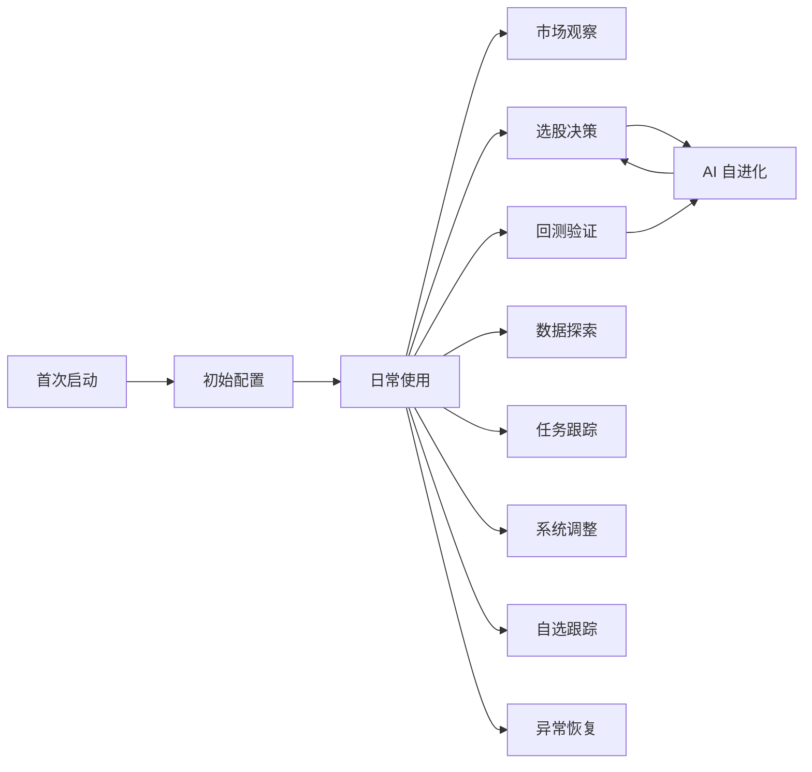

# QTrading 用户需求文档

> **文档定位**：用户视角需求文档（非实现规范）
> **版本**：v1.2
> **维护者**：QTrading 项目组
> **更新日期**：2026-07-20
> **对应项目版本**：0.9.0

---

## 0. 文档元信息

### 0.1 文档定位

本文件是 QTrading（AStockScreener）项目的**用户视角需求文档**，描述目标用户希望项目帮助解决的问题、提供的能力、带来的体验。

本文件**不是**：

- 实现规范（参见 `CONTRIBUTING.md`）
- 项目宪法与红线（参见 `CLAUDE.md`）
- 项目对外介绍（参见 `README.md`）
- 架构设计文档（参见 `docs/`）

### 0.2 目标读者

- **项目负责人 / 产品决策者**：理解用户期望，指导优先级决策
- **用户自身**：了解项目能力边界，确认是否满足自身需求
- **新加入的开发者**：理解用户期望，避免技术视角偏离用户价值

### 0.3 阅读指南

- **首次阅读**：建议从第 1-2 章建立背景 → 第 4 章理解用户旅程 → 按需查阅第 5-6 章
- **需求查阅**：直接查阅第 5 章（功能性需求）和第 6 章（非功能性需求）
- **变更管理**：参阅第 9 章变更历史

### 0.4 与其他文档的关系

| 文档 | 视角 | 与本文档关系 |
|------|------|------------|
| `CLAUDE.md` | 开发宪法 | 不重叠（本文档不涉及实现红线） |
| `CONTRIBUTING.md` | 实现规范 | 不重叠（本文档不涉及实现规范） |
| `README.md` | 项目介绍 | 提供项目定位输入，本文档不重复其内容 |
| `docs/` | 架构 / 模式 / 治理 | 不重叠（本文档不是开发文档） |

### 0.5 撰写原则

1. **用户语言**：用"用户希望 / 用户需要 / 用户期望"代替"项目实现 / 系统提供"
2. **能力级抽象**：描述用户希望拥有的能力，不绑定具体 UI 控件、状态机、数据结构
3. **价值导向**：每条需求说明用户为什么需要它（解决什么问题、带来什么价值）
4. **场景驱动**：以用户使用场景组织需求，而非以系统模块组织
5. **不预设实现**：不描述"应该用什么技术实现"，留给后续设计阶段
6. **范围聚焦**：仅覆盖与当前项目定位一致的需求，不描述超范围的未来需求

---

## 1. 项目愿景与定位

### 1.1 一句话定位

用户希望 QTrading 是一个**极速、隐私优先的本地化 A 股量化选股与深度分析工具**。

### 1.2 用户希望解决的核心问题

1. **海量股票数据难以高效筛选**：A 股 5000+ 上市公司，用户难以从全市场快速筛选出符合特定条件的标的
2. **传统选股缺乏深度分析**：单纯的指标筛选无法提供深度投研视角，缺乏对个股的多维度综合分析
3. **云端 AI 服务存在隐私顾虑**：商业 AI 投研工具通常要求将持仓、交易、研究数据上传云端，用户担忧数据泄露
4. **商业量化工具门槛高、不灵活**：专业量化平台成本高、策略不可定制、本地化能力弱

### 1.3 项目希望为用户创造的价值

1. **漏斗式决策**：先用数学指标毫秒级初筛海量股票，再用 AI 深度回顾候选标的，兼顾效率与深度
2. **自进化 AI**：自动跟踪历史选股结果的实际表现，让 AI 越用越准，持续学习用户的成功经验与失误陷阱
3. **隐私保障**：核心投研逻辑可完全在本地运行（本地 AI 模型 + 本地数据库 + 本地存储），用户数据不离本机
4. **数据质量保障**：三级数据质量校验，让用户的量化决策建立在可靠数据底座上
5. **工业级回测**：向量化回测框架，让用户在毫秒级验证策略历史表现，避免"纸上谈兵"

### 1.4 项目不做什么（边界声明）

为了让用户对项目边界有清晰预期，明确以下**不属于本项目范围**：

| 不做的事 | 原因 |
|---------|------|
| 实盘交易对接 | 本项目是投研工具，不涉及交易执行 |
| 行情实时推送（分钟级 / Tick 级） | 本项目聚焦日级量化分析，不追求高频交易场景 |
| 云端账户同步 | 隐私优先定位，用户数据不离开本机 |
| 投资建议自动执行 | 决策权完全在用户，项目仅提供分析辅助 |
| 多用户协作 / 社区分享 | 单机本地化定位，不做社交化功能 |
| 策略市场 / 付费策略 | 开源工具定位，策略代码用户自行维护 |
| 港股 / 美股 / 加密货币 | 聚焦 A 股市场 |

---

## 2. 目标用户画像（User Personas）

> **说明**：以下画像基于项目定位推导，非真实用户调研结果。每类用户的目标、痛点、期望能力用于指导需求优先级判断。

### 2.1 个人量化研究者

| 字段 | 内容 |
|------|------|
| **用户特征** | 有量化研究基础，熟悉 Python / 数据分析工具，追求策略的科学验证 |
| **核心目标** | 验证自己的选股逻辑在 A 股历史数据上的表现，迭代优化策略参数 |
| **主要痛点** | 商业平台策略不可定制；自建回测框架耗时；数据质量难以保障 |
| **期望能力** | 灵活的策略参数调整；毫秒级回测；多维度绩效指标；数据质量可见 |
| **使用频率** | 高频（每日使用） |

### 2.2 资深 A 股散户

| 字段 | 内容 |
|------|------|
| **用户特征** | 有多年 A 股投资经验，希望借 AI 提升决策质量，对工具成本敏感 |
| **核心目标** | 借助 AI + 量化工具发现投资机会，避免情绪化决策 |
| **主要痛点** | 海量信息难以消化；自身分析缺乏深度；商业 AI 工具月费高 |
| **期望能力** | 一键选股；AI 深度分析；新闻聚合；操作简单易上手 |
| **使用频率** | 中频（每周 2-3 次） |

### 2.3 量化开发爱好者

| 字段 | 内容 |
|------|------|
| **用户特征** | 喜欢研究策略代码、关注架构设计、希望工具可扩展 |
| **核心目标** | 学习与扩展量化策略，理解 AI 与量化的结合方式 |
| **主要痛点** | 开源量化项目文档稀少；架构不清晰难以二次开发 |
| **期望能力** | 策略可注册扩展；代码架构清晰；可注入自定义 AI 模型 |
| **使用频率** | 中频（每周 1-2 次） |

### 2.4 隐私敏感型用户

| 字段 | 内容 |
|------|------|
| **用户特征** | 拒绝将持仓 / 交易 / 研究数据上传云端，追求本地推理，注重数据主权 |
| **核心目标** | 在不泄露任何数据的前提下，获得 AI 投研辅助 |
| **主要痛点** | 云端 AI 工具要求上传数据；本地 AI 工具能力弱；部署门槛高 |
| **期望能力** | 本地 AI 模型推理；凭证加密存储；数据完全本地化 |
| **使用频率** | 中高频（每日或隔日） |

---

## 3. 用户需求总览

### 3.1 用户需求分层

| 层级 | 类型 | 包含需求 |
|------|------|---------|
| **基础需求（Must）** | 用户运行项目必须满足 | 市场行情查看、策略选股、数据同步、基础配置 |
| **进阶需求（Should）** | 提升用户决策深度 | AI 深度分析、策略回测、任务管理、数据探索、自选收藏与跟踪、策略参数模板 |
| **专业需求（Could）** | 满足高级用户偏好 | 本地 AI 推理、AI 自进化、自动化计划、多 AI 切换、多股对比、自然语言选股 |

### 3.2 用户痛点 → 期望能力映射

| 用户痛点 | 期望能力 |
|---------|---------|
| 海量股票难以高效筛选 | 毫秒级全市场选股 |
| 单一指标筛选不够全面 | 多维度策略组合筛选 |
| 选股结果缺乏深度分析 | AI 流式深度回顾 |
| 不知道策略历史表现 | 向量化历史回测 |
| 担忧云端 AI 隐私 | 本地 AI 推理 |
| 不知道 AI 分析是否靠谱 | AI 自进化闭环（自动跟踪历史准确率） |
| 数据来源不可靠 | 三级数据质量门控 |
| 不知道数据是否最新 | 同步进度与时效可见 |
| 长时间任务不可见 | 异步任务进度跟踪 |
| 长时间任务不可中断 | 任务可取消 |
| 想自定义查询数据 | SQL 控制台与表浏览器 |
| 配置丢失 | 配置持久化与升级兼容 |
| 不懂英文 | 中英文双语切换 |
| 出错不知原因 | 友好的错误提示与诊断导出 |
| 关闭应用丢任务 | 优雅退出与状态保存 |
| 选出的好股票想持续关注 | 收藏候选股并跟踪后续动态 |
| 调好的参数想下次直接复用 | 策略参数模板保存 |
| 几只候选股难以取舍 | 多股并排对比 |
| 不想逐项记忆指标条件 | 自然语言描述选股想法 |
| 担心被 AI 分析误导 | 风险提示与免责声明可见 |
| 看不懂专业术语 | 内置帮助与术语解释 |

### 3.3 需求优先级矩阵

| 优先级 | 含义 | 占比目标 |
|--------|------|---------|
| **Must** | 用户运行项目必须满足，缺失则项目不可用 | ~40% |
| **Should** | 提升用户决策深度，缺失则项目价值大幅降低 | ~40% |
| **Could** | 满足高级用户偏好，缺失不影响基础使用 | ~20% |

---

## 4. 完整用户旅程（User Journeys）

### 4.1 旅程总览图

### 4.2 旅程 A：首次启动与初始配置

**触发场景**：用户首次安装并启动应用

**用户目标**：从零开始完成所有必要配置，让项目达到可用状态

**操作步骤**：
1. 启动应用，看到欢迎页
2. 配置数据库连接（地址 / 端口 / 用户名 / 密码 / 数据库名）
3. 配置数据源凭证（Tushare Token）
4. 配置 AI 服务（可选：云端 LLM API Key 或本地模型路径）
5. 执行初始数据同步（快速或完整两种模式）
6. 设置自动化计划（可选：每日定时同步时间）
7. 完成配置，进入主界面

**期望反馈**：
- 每步操作有清晰的进度提示
- 配置项有默认值或推荐值，降低决策成本
- 凭证输入有安全提示（不会明文显示）
- 数据同步进度可见，可中断
- 配置错误时给出明确原因（如数据库连接失败的具体原因）

**异常分支**：
- 数据库连接失败 → 提示具体原因（密码错误 / 网络不通 / 版本不兼容）→ 用户可重新配置
- Tushare Token 无效 → 提示验证失败 → 用户可重新输入或跳过
- AI 服务连接失败 → 提示具体原因 → 用户可跳过（不影响基础选股功能）
- 数据同步中断 → 用户可取消并保留已同步数据 → 后续可继续同步
- 数据库需要升级 → 提示用户确认升级 → 升级成功后继续

**完成标志**：用户看到主界面，市场行情数据可见

### 4.3 旅程 B：日常市场行情浏览

**触发场景**：用户早晨开盘前 / 盘中 / 盘后想快速了解市场状态

**用户目标**：快速把握市场全貌，发现当日热点

**操作步骤**：
1. 打开应用，进入市场行情界面
2. 查看主要指数（上证 / 深证 / 创业板 / 科创 50）的实时或最新行情
3. 查看沪深港通资金流向（北向 / 南向净流入）
4. 查看热门概念板块（涨幅榜 / 跌幅榜）
5. 查看自选股的当日表现与相关动态
6. 浏览最新市场新闻（支持分页加载）
7. 如发现感兴趣的概念或个股，点击进入深度查看

**期望反馈**：
- 行情数据一目了然（涨跌颜色区分）
- 数据时效性明确标识（如是当日还是隔日数据）
- 新闻按时间倒序排列，新新闻有视觉提示
- 点击概念 / 个股可快速跳转查看详情

**异常分支**：
- 数据未同步（隔日数据）→ 明确标识"数据可能过期"
- 网络异常 → 显示本地缓存数据，提示网络问题
- 新闻源不可用 → 显示历史新闻，提示"实时新闻暂时不可用"

**完成标志**：用户对当日市场有整体认知

### 4.4 旅程 C：策略选股决策

**触发场景**：用户希望基于特定逻辑筛选股票

**用户目标**：从全市场筛选出符合条件的候选股票，并获得 AI 深度分析

**操作步骤**：
1. 进入选股界面
2. 选择模式：实时选股 或 历史选股回看
3. （实时模式）选择策略类型（如超跌反弹、价值、成长、市场突破、北向资金、AI 主动选股等）
4. 调整策略参数（如 RSI 阈值、PE 区间、换手率下限等），或加载已保存的参数模板
5. 点击"运行策略"
6. 等待策略执行，查看 AI 流式分析过程
7. 浏览选股结果（支持分页 / 排序）
8. 点击感兴趣的个股，查看深度详情
9. （可选）收藏候选股票到自选列表，持续跟踪其动态
10. （可选）导出结果（CSV / Excel）

**期望反馈**：
- 策略执行过程可见（不是黑盒等待）
- AI 分析以流式方式呈现（思维链 + 最终结论）
- 结果表格支持分页与多列排序
- 个股详情包含技术面 / 基本面 / 资金面 / 新闻 / 概念等多维度信息
- 导出文件保留完整字段

**异常分支**：
- 数据质量不满足策略要求 → 提示具体缺失数据，引导用户先同步
- 策略执行失败 → 显示错误原因，保留用户已配置的参数
- AI 服务不可用 → 退化为纯数学策略结果，明确告知用户
- 结果为空 → 提示用户调整参数

**完成标志**：用户获得选股结果并完成决策

### 4.5 旅程 D：策略历史回测验证

**触发场景**：用户想验证某策略在过去一段时间的实际表现

**用户目标**：通过历史回测评估策略有效性，避免"纸上谈兵"

**操作步骤**：
1. 进入回测界面
2. 选择要回测的策略
3. 配置回测参数：
   - 时间范围（开始日期 / 结束日期）
   - 初始资金
   - 交易成本（佣金 / 印花税 / 滑点）
   - 仓位分配方式（等权 / 市值加权 / 风险平价）
4. 点击"运行回测"
5. 查看回测进度，可取消
6. 查看回测结果：
   - 核心指标（年化收益 / 夏普比率 / 最大回撤 / 胜率 / Alpha / Beta）
   - 净值曲线
   - 交易明细
7. （可选）加载历史回测结果对比

**期望反馈**：
- 回测进度可见，长时间回测可取消
- 结果指标完整，便于横向对比
- 净值曲线直观展示策略表现
- 回测考虑真实交易成本（佣金 / 印花税 / 滑点）
- 涨跌停板限制（不能买入涨停股 / 卖出跌停股）

**异常分支**：
- 历史数据不足 → 提示用户先同步对应时间段数据
- 策略无信号 → 明确告知"策略在该时段无交易信号"
- 回测过程异常 → 保留已计算部分结果，显示错误原因

**完成标志**：用户对策略历史表现有清晰认知

### 4.6 旅程 E：数据自由探索

**触发场景**：用户想自定义查询数据库中的数据

**用户目标**：通过表浏览或自定义 SQL 查询，获取特定数据

**操作步骤**：
1. 进入数据探索界面
2. 选择模式：表浏览 或 SQL 控制台
3. （表浏览模式）：
   - 选择要查看的数据表
   - 设置过滤条件（列 / 操作符 / 值）
   - 设置排序
   - 查询并浏览结果（分页）
   - （可选）导出当前页或全部数据
4. （SQL 控制台模式）：
   - 输入 SQL 语句（或使用快捷模板）
   - 执行查询
   - 查看结果（限制 100 行以内的展示）
   - （可选）导出结果

**期望反馈**：
- 表名和列名有友好的中文别名
- 查询响应迅速
- 过滤条件直观易用
- SQL 执行成功 / 失败有明确反馈
- 大数据量查询不会卡死界面

**异常分支**：
- SQL 语法错误 → 显示具体错误位置与原因
- 查询超时 → 提示超时，建议优化查询
- 表不存在 → 列出可用表供选择

**完成标志**：用户获取到所需数据

### 4.7 旅程 F：异步任务跟踪

**触发场景**：用户启动了长时间运行的任务（如数据同步、批量 AI 分析、回测等）

**用户目标**：实时了解任务进度，必要时取消任务

**操作步骤**：
1. 进入任务中心
2. 查看所有任务列表（含状态、进度、类型）
3. 对运行中的任务：
   - 查看实时进度
   - （可选）取消任务
4. 查看已完成任务的结果摘要
5. （可选）清理已完成任务，保持列表整洁

**期望反馈**：
- 任务状态清晰（排队中 / 运行中 / 已完成 / 失败 / 已取消 / 已中断）
- 进度条准确反映任务进度
- 任务类型有视觉标识（便于快速识别）
- 取消操作即时生效
- 失败任务显示失败原因

**异常分支**：
- 任务执行失败 → 显示错误原因，可重新提交
- 任务被意外中断（如应用崩溃）→ 重启后可恢复或清理
- 取消操作延迟 → 明确提示"正在取消..."

**完成标志**：用户了解所有任务的状态

### 4.8 旅程 G：系统个性化调整

**触发场景**：用户想根据自己偏好调整系统配置

**用户目标**：让项目更符合个人使用习惯

**操作步骤**：
1. 进入设置界面
2. 选择调整类别：
   - 数据源（健康检查、全量同步、AI 概念重建、缓存清理、历史数据初始化）
   - 数据库（连接配置）
   - AI 大脑（云端 LLM、自动故障转移、本地模型、AI 调优、Prompt 编辑）
   - 自动化（自动更新开关与时间、AI 概念更新、搜索引擎）
   - 通知（新闻提醒开关与间隔）
   - 系统（语言、主题、日志级别、并发数、代理、诊断导出、Tushare 积分档位）
3. 调整具体配置
4. 保存配置
5. （部分配置）应用需要重启生效

**期望反馈**：
- 配置项有清晰的说明文字
- 修改后立即反馈保存成功 / 失败
- 危险操作（如清空缓存）有二次确认
- 配置错误时给出具体原因
- 高级配置项有默认值，普通用户无需调整

**异常分支**：
- 配置保存失败 → 显示原因，保留用户输入
- 重启后配置丢失 → 提示用户检查配置文件权限
- 配置导致应用无法启动 → 提供安全模式或配置重置入口

**完成标志**：用户的个性化设置已生效

### 4.9 旅程 H：AI 自进化体验

**触发场景**：用户使用一段时间后，希望感知 AI 的进步

**用户目标**：看到 AI 分析越来越准，理解 AI 学习过程

**操作步骤**：
1. 用户日常使用选股功能，AI 产生分析结果
2. 系统自动跟踪后续 T+1 / T+5 实际收益
3. 系统自动计算 Alpha（相对于基准指数的超额收益）
4. 系统标记成功案例（Win）与失误案例（Loss）
5. 后续 AI 分析时，系统自动注入历史经验作为学习上下文
6. 用户可感知 AI 分析越来越贴近实际

**期望反馈**：
- AI 分析结论有明确的可验证性（如"建议关注 X 股，预期 T+1 涨幅 Y%"）
- 历史准确率可见（让用户对 AI 有信任基础）
- AI 学习过程对用户透明（非黑盒）
- 失误案例不会反复出现

**异常分支**：
- 基准指数数据缺失 → 跳过 Alpha 计算，仅记录绝对收益
- 历史经验数据不足 → 退化为无学习上下文模式

**完成标志**：用户对 AI 分析有持续信任

### 4.10 旅程 I：异常恢复与优雅退出

**触发场景**：用户关闭应用 / 应用崩溃 / 系统异常

**用户目标**：退出过程不丢失数据与状态，重启后能恢复

**操作步骤**：
1. 用户点击关闭按钮
2. 系统提示"正在保存状态..."（如有未完成任务）
3. 系统完成清理：
   - 保存未完成任务状态
   - 关闭数据库连接
   - 卸载本地 AI 模型（释放内存）
   - 取消所有异步任务
4. 应用退出
5. （下次启动）系统恢复上次状态

**期望反馈**：
- 退出过程不超过几秒
- 长时间未响应有看门狗强制退出机制
- 重启后任务历史保留
- 配置不丢失

**异常分支**：
- 退出超时 → 看门狗强制退出，不阻塞用户
- 退出过程出错 → 显示错误日志，但允许用户强制退出
- 重启后状态损坏 → 提供安全模式启动

**完成标志**：用户顺利退出，重启后状态正常

---

## 5. 功能性需求

> **编号规则**：FR-<场景>-<序号>，如 FR-ONBOARD-001
> **用户故事格式**：作为 <画像>，我希望 <能力>，以便 <价值>
> **优先级**：Must / Should / Could

### 5.1 启动与初始配置需求（FR-ONBOARD-*）

#### FR-ONBOARD-001: 首次启动引导

**用户故事**：作为新用户，我希望首次启动时有清晰的引导流程，以便快速完成必要配置而不被复杂选项困扰

**优先级**：Must

**关联旅程**：旅程 A

**验收标准**：
- 给定用户首次启动应用，当应用检测到无配置时，则自动进入引导流程
- 给定用户在引导流程中，当用户完成每一步时，则有清晰的下一步指引
- 给定用户在引导流程中，当用户跳过可选步骤时，则应用明确告知该步骤的影响

#### FR-ONBOARD-002: 数据库配置

**用户故事**：作为用户，我希望能在引导流程中配置数据库连接，以便项目有地方存储数据

**优先级**：Must

**关联旅程**：旅程 A

**验收标准**：
- 给定用户进入数据库配置步骤，当用户输入连接信息后，则可以测试连接是否成功
- 给定用户连接测试失败，当显示错误时，则错误信息明确指出原因（如密码错误、网络不通）
- 给定用户连接成功，当用户继续下一步时，则配置被持久化保存

#### FR-ONBOARD-003: 数据源凭证配置

**用户故事**：作为用户，我希望配置数据源访问凭证（如 Tushare Token），以便项目能拉取行情数据

**优先级**：Must

**关联旅程**：旅程 A

**验收标准**：
- 给定用户进入数据源配置步骤，当用户输入 Token 后，则可以验证 Token 有效性
- 给定 Token 验证成功，当显示结果时，则显示用户的数据档位（如积分等级、可用 API 范围）
- 给定用户跳过此步骤，当用户继续时，则明确告知"未配置数据源将无法拉取新数据"

#### FR-ONBOARD-004: AI 服务配置

**用户故事**：作为用户，我希望配置 AI 服务（云端或本地），以便获得 AI 深度分析能力

**优先级**：Should

**关联旅程**：旅程 A

**验收标准**：
- 给定用户进入 AI 配置步骤，当用户选择云端 LLM 时，则可以选择供应商并测试连接
- 给定用户选择本地模型，当用户提供模型文件路径后，则可以验证模型可用性
- 给定用户跳过此步骤，当用户继续时，则明确告知"未配置 AI 将仅支持纯数学策略"

#### FR-ONBOARD-005: 初始数据同步

**用户故事**：作为新用户，我希望在引导流程中执行初始数据同步，以便项目立即可用

**优先级**：Must

**关联旅程**：旅程 A

**验收标准**：
- 给定用户进入数据同步步骤，当用户选择同步模式（快速 / 完整）时，则开始同步
- 给定同步进行中，当用户查看进度时，则可以看到当前同步表、进度百分比、预计剩余时间
- 给定同步过程中，当用户点击取消时，则同步可被中断并保留已同步数据
- 给定同步完成，当用户继续时，则可以进入主界面使用项目

#### FR-ONBOARD-006: 自动化计划设置

**用户故事**：作为用户，我希望设置每日定时同步计划，以便数据保持最新而无需手动操作

**优先级**：Could

**关联旅程**：旅程 A

**验收标准**：
- 给定用户进入自动化设置步骤，当用户开启定时同步时，则可以选择同步时间
- 给定用户设置完成，当到达指定时间时，则系统自动执行同步
- 给定用户跳过此步骤，当用户继续时，则可以稍后在系统设置中开启

#### FR-ONBOARD-007: 数据库自动升级

**用户故事**：作为用户，我希望项目升级后数据库能自动迁移，以便保留历史数据

**优先级**：Must

**关联旅程**：旅程 A

**验收标准**：
- 给定用户启动新版本，当数据库版本不匹配时，则提示用户确认升级
- 给定用户确认升级，当迁移执行时，则进度可见且不丢失历史数据
- 给定迁移失败，当回滚时，则数据库恢复到迁移前状态

### 5.2 市场行情观察需求（FR-MARKET-*）

#### FR-MARKET-001: 主要指数行情

**用户故事**：作为用户，我希望在市场行情界面看到主要指数的最新行情，以便快速把握市场整体走势

**优先级**：Must

**关联旅程**：旅程 B

**验收标准**：
- 给定用户进入市场行情界面，当数据已同步时，则可以看到上证、深证、创业板、科创 50 等主要指数的最新行情
- 给定指数上涨，当显示行情时，则用红色（或用户主题对应的涨色）标识
- 给定指数下跌，当显示行情时，则用绿色（或用户主题对应的跌色）标识

#### FR-MARKET-002: 资金流向观察

**用户故事**：作为用户，我希望看到沪深港通资金流向，以便了解外资动向

**优先级**：Should

**关联旅程**：旅程 B

**验收标准**：
- 给定用户进入市场行情界面，当资金流向数据可用时，则可以看到北向资金净流入
- 给定资金净流入，当显示数据时，则用颜色标识正负流向

#### FR-MARKET-003: 热门板块追踪

**用户故事**：作为用户，我希望看到热门概念板块的涨跌情况，以便发现市场热点

**优先级**：Should

**关联旅程**：旅程 B

**验收标准**：
- 给定用户进入市场行情界面，当概念数据可用时，则可以看到热门概念板块列表
- 给定用户点击某概念，当查看详情时，则可以看到该概念的成分股

#### FR-MARKET-004: 新闻资讯浏览

**用户故事**：作为用户，我希望在市场行情界面浏览最新市场新闻，以便快速获取市场资讯

**优先级**：Should

**关联旅程**：旅程 B

**验收标准**：
- 给定用户进入市场行情界面，当新闻数据可用时，则可以看到最新新闻列表
- 给定用户点击"加载更多"，当还有更多新闻时，则加载下一页
- 给定新闻有 AI 标签，当显示新闻时，则标签可见

#### FR-MARKET-005: 数据时效感知

**用户故事**：作为用户，我希望知道当前看到的数据是何时更新的，以便判断数据是否过期

**优先级**：Must

**关联旅程**：旅程 B

**验收标准**：
- 给定用户进入市场行情界面，当数据已同步时，则可以看到数据日期
- 给定数据日期不是当日，当显示数据时，则明确标识"数据可能过期"
- 给定用户最近未同步数据，当显示行情时，则提示用户同步

### 5.3 策略选股决策需求（FR-SCREENER-*）

#### FR-SCREENER-001: 多策略选择

**用户故事**：作为用户，我希望从多种类型的选股策略中选择，覆盖超跌反弹、价值、成长、市场突破、北向资金、AI 主动选股等不同维度，以便从不同角度筛选股票

**优先级**：Must

**关联旅程**：旅程 C

**验收标准**：
- 给定用户进入选股界面，当查看策略列表时，则可以看到多种类型的策略
- 给定用户选择某策略，当查看策略说明时，则可以看到策略的逻辑描述与适用场景
- 给定用户选择某策略，当策略需要特定数据时，则提示用户该策略的数据要求

#### FR-SCREENER-002: 策略参数调整

**用户故事**：作为用户，我希望可以调整策略参数（如阈值、区间、过滤条件），以便根据自己的判断定制筛选逻辑

**优先级**：Must

**关联旅程**：旅程 C

**验收标准**：
- 给定用户选择某策略，当查看参数时，则可以看到该策略可调的参数列表
- 给定用户调整参数，当参数超出合理范围时，则提示用户
- 给定用户调整参数，当查看说明时，则可以看到每个参数的含义与推荐值

#### FR-SCREENER-003: 实时选股执行

**用户故事**：作为用户，我希望点击"运行"后策略立即执行，以便快速看到筛选结果

**优先级**：Must

**关联旅程**：旅程 C

**验收标准**：
- 给定用户配置好策略，当点击"运行"时，则策略在后台异步执行
- 给定策略执行中，当用户查看状态时，则可以看到执行进度
- 给定策略执行完成，当结果可用时，则自动展示结果

#### FR-SCREENER-004: AI 深度分析

**用户故事**：作为用户，我希望对筛选出的候选股票获得 AI 深度分析，以便从多维度综合判断投资价值

**优先级**：Should

**关联旅程**：旅程 C

**验收标准**：
- 给定策略执行完成，当 AI 服务可用时，则自动对候选股票进行 AI 分析
- 给定 AI 分析进行中，当查看过程时，则可以看到 AI 思维链流式输出
- 给定 AI 分析完成，当查看结果时，则可以看到包含评分与建议的综合报告

#### FR-SCREENER-005: 选股结果浏览

**用户故事**：作为用户，我希望选股结果以表格形式展示，支持分页与排序，以便高效浏览大量结果

**优先级**：Must

**关联旅程**：旅程 C

**验收标准**：
- 给定选股结果可用，当查看结果时，则以表格形式展示
- 给定结果数量较大，当浏览时，则支持分页
- 给定用户点击列头，当排序时，则按该列升序 / 降序排列
- 给定结果数量超过 1000 行，当浏览时，则操作不卡顿

#### FR-SCREENER-006: 个股深度查看

**用户故事**：作为用户，我希望点击某只股票可以查看其深度详情，以便全面了解该股票

**优先级**：Should

**关联旅程**：旅程 C

**验收标准**：
- 给定用户在选股结果中点击某只股票，当查看详情时，则可以看到技术面 / 基本面 / 资金面 / 新闻 / 概念等多维度信息
- 给定用户查看个股详情，当数据不可用时，则明确标识"该数据暂未同步"

#### FR-SCREENER-007: 历史选股回看

**用户故事**：作为用户，我希望查看历史选股结果，以便回顾过去的决策与结果

**优先级**：Should

**关联旅程**：旅程 C

**验收标准**：
- 给定用户切换到历史模式，当查看历史树时，则可以按日期 / 策略浏览历史选股
- 给定用户点击某历史节点，当查看详情时，则可以看到当时的选股结果

#### FR-SCREENER-008: 结果导出

**用户故事**：作为用户，我希望将选股结果导出为文件（CSV / Excel），以便离线分析或与他人分享

**优先级**：Should

**关联旅程**：旅程 C

**验收标准**：
- 给定选股结果可用，当用户点击导出时，则可以选择 CSV 或 Excel 格式
- 给定用户选择导出格式，当确认后，则文件保存到用户指定路径
- 给定导出完成，当查看文件时，则包含所有字段的完整数据

#### FR-SCREENER-009: 策略 Prompt 自定义

**用户故事**：作为进阶用户，我希望可以查看与修改策略的 AI Prompt，以便定制 AI 分析逻辑

**优先级**：Could

**关联旅程**：旅程 C

**验收标准**：
- 给定用户选择某策略，当查看 Prompt 时，则可以看到该策略的当前 Prompt 模板
- 给定用户修改 Prompt，当保存时，则后续 AI 分析使用新 Prompt
- 给定用户想恢复默认，当点击重置时，则 Prompt 恢复为默认值

#### FR-SCREENER-010: 策略参数模板

**用户故事**：作为用户，我希望把调好的策略参数保存为模板，以便下次直接复用而不必逐项重新调整

**优先级**：Should

**关联旅程**：旅程 C

**验收标准**：
- 给定用户调整好一组参数，当选择保存为模板时，则可以命名并保存
- 给定用户再次使用同一策略，当查看模板列表时，则可以一键加载已保存的参数组合
- 给定用户不再需要某模板，当删除时，则模板被移除

#### FR-SCREENER-011: 候选股并排对比

**用户故事**：作为用户，我希望把几只候选股票放在一起并排对比关键指标，以便在它们之间做出取舍

**优先级**：Could

**关联旅程**：旅程 C

**验收标准**：
- 给定用户在选股结果中勾选多只股票，当选择对比时，则可以看到关键指标（估值 / 成长 / 技术面 / AI 评分）并排展示
- 给定对比视图，当某项指标明显更优时，则有视觉提示帮助快速识别

#### FR-SCREENER-012: 自然语言选股

**用户故事**：作为用户，我希望可以用一句自然语言描述选股想法（例如"低估值高成长的科技股"），由 AI 转化为筛选条件并执行，以便不必逐项记忆指标参数

**优先级**：Could

**关联旅程**：旅程 C

**验收标准**：
- 给定用户输入自然语言选股描述，当提交后，则 AI 解析出对应的筛选条件并向用户确认
- 给定解析结果不符合预期，当用户修正描述后，则重新解析
- 给定条件确认无误，当执行时，则产出与普通策略一致的选股结果

### 5.4 策略回测验证需求（FR-BACKTEST-*）

#### FR-BACKTEST-001: 回测参数配置

**用户故事**：作为用户，我希望可以自定义回测参数（时间范围、资金、交易成本、仓位分配方式），以便真实模拟策略表现

**优先级**：Must

**关联旅程**：旅程 D

**验收标准**：
- 给定用户进入回测界面，当配置参数时，则可以设置时间范围、初始资金、佣金率、滑点
- 给定用户选择仓位分配方式，当查看选项时，则可以从等权 / 市值加权 / 风险平价等方式中选择
- 给定用户配置完成，当参数不合理时，则提示用户

#### FR-BACKTEST-002: 回测执行与跟踪

**用户故事**：作为用户，我希望回测过程可见且可取消，以便长时间回测不必等待

**优先级**：Must

**关联旅程**：旅程 D

**验收标准**：
- 给定用户启动回测，当回测进行中时，则可以看到进度与状态消息
- 给定用户点击取消，当回测被取消时，则立即停止并释放资源
- 给定回测完成，当结果可用时，则自动展示结果

#### FR-BACKTEST-003: 回测结果展示

**用户故事**：作为用户，我希望看到完整的回测绩效指标，以便科学评估策略表现

**优先级**：Must

**关联旅程**：旅程 D

**验收标准**：
- 给定回测完成，当查看结果时，则可以看到年化收益、夏普比率、最大回撤、胜率、Alpha、Beta、IC 等核心指标
- 给定回测完成，当查看净值曲线时，则可以直观看到策略与基准的对比
- 给定回测完成，当查看交易明细时，则可以看到每笔交易的开仓 / 平仓信息

#### FR-BACKTEST-004: 真实交易成本建模

**用户故事**：作为用户，我希望回测考虑真实交易成本（佣金 / 印花税 / 滑点）与涨跌停限制，以便结果贴近实际

**优先级**：Should

**关联旅程**：旅程 D

**验收标准**：
- 给定回测配置了佣金率与滑点，当执行交易时，则按配置扣除成本
- 给定某日某股票涨停，当策略发出买入信号时，则该笔买入不成交
- 给定某日某股票跌停，当策略发出卖出信号时，则该笔卖出不成交

#### FR-BACKTEST-005: 历史回测回看

**用户故事**：作为用户，我希望查看历史回测结果，以便对比不同策略或不同参数的表现

**优先级**：Should

**关联旅程**：旅程 D

**验收标准**：
- 给定用户查看历史回测，当查看列表时，则可以看到过往所有回测的摘要
- 给定用户点击某历史回测，当加载详情时，则可以看到完整的回测结果

#### FR-BACKTEST-006: 回测结果导出

**用户故事**：作为用户，我希望将回测结果导出，以便离线分析或归档

**优先级**：Could

**关联旅程**：旅程 D

**验收标准**：
- 给定回测完成，当用户选择导出时，则可以保存结果到文件

#### FR-BACKTEST-007: 前视偏差防护

**用户故事**：作为量化研究者，我希望回测严格避免前视偏差（不使用未来数据），以便回测结果可信

**优先级**：Must

**关联旅程**：旅程 D

**验收标准**：
- 给定策略在 T 日产生信号，当回测执行时，则仅使用 T 日及之前的数据
- 给定回测执行交易，当成交时，则在 T+1 日开盘（避免当日信号当日成交）
- 给定财务数据有发布日期，当回测使用时，则按发布日期而非报告期使用

### 5.5 数据自由探索需求（FR-DATA-*）

#### FR-DATA-001: 数据表浏览

**用户故事**：作为用户，我希望以表形式浏览数据库内容，以便快速查看数据

**优先级**：Should

**关联旅程**：旅程 E

**验收标准**：
- 给定用户进入数据探索界面，当查看表列表时，则可以看到所有可用数据表
- 给定用户选择某表，当查看数据时，则可以分页浏览
- 给定用户设置过滤条件，当查询时，则仅显示符合条件的数据
- 给定用户设置排序，当查询时，则按指定列排序

#### FR-DATA-002: 自定义查询

**用户故事**：作为高级用户，我希望可以直接执行 SQL 查询，以便灵活获取所需数据

**优先级**：Could

**关联旅程**：旅程 E

**验收标准**：
- 给定用户进入 SQL 控制台，当输入 SQL 语句时，则可以执行查询
- 给定查询成功，当查看结果时，则显示结果数据
- 给定查询失败，当显示错误时，则错误信息明确指出原因
- 给定用户不熟悉 SQL，当查看快捷模板时，则可以使用预设模板

#### FR-DATA-003: 数据导出

**用户故事**：作为用户，我希望将查询结果导出，以便在外部工具中分析

**优先级**：Should

**关联旅程**：旅程 E

**验收标准**：
- 给定用户在表浏览模式，当导出时，则可以选择当前页或全部数据
- 给定用户选择导出格式，当确认后，则保存为 CSV 或 Excel 文件

#### FR-DATA-004: 友好的字段命名

**用户故事**：作为用户，我希望表名与列名有中文别名，以便理解数据含义

**优先级**：Should

**关联旅程**：旅程 E

**验收标准**：
- 给定用户查看表列表，当浏览时，则可以看到表的中文名称
- 给定用户查看某表数据，当浏览列头时，则可以看到列的中文别名

### 5.6 异步任务管理需求（FR-TASK-*）

#### FR-TASK-001: 任务进度跟踪

**用户故事**：作为用户，我希望看到所有异步任务的状态与进度，以便了解项目在做什么

**优先级**：Must

**关联旅程**：旅程 F

**验收标准**：
- 给定用户进入任务中心，当查看任务列表时，则可以看到所有任务的状态（排队中 / 运行中 / 已完成 / 失败 / 已取消 / 已中断）
- 给定任务运行中，当查看进度时，则可以看到进度条与状态消息
- 给定任务完成，当查看结果时，则可以看到任务摘要

#### FR-TASK-002: 任务取消

**用户故事**：作为用户，我希望可以取消运行中的任务，以便及时停止不需要的操作

**优先级**：Must

**关联旅程**：旅程 F

**验收标准**：
- 给定任务运行中且可取消，当用户点击取消时，则任务被中断
- 给定任务取消请求发出，当任务实际停止时，则状态更新为"已取消"
- 给定任务不可取消（如已进入不可中断阶段），当用户点击取消时，则明确告知

#### FR-TASK-003: 历史任务清理

**用户故事**：作为用户，我希望可以清理已完成的任务，以便保持任务列表整洁

**优先级**：Should

**关联旅程**：旅程 F

**验收标准**：
- 给定任务列表中有已完成任务，当用户点击清理时，则清除这些任务
- 给定用户清理任务，当清理完成时，则任务列表更新

#### FR-TASK-004: 任务失败重试

**用户故事**：作为用户，我希望失败的任务可以重新提交，以便在修复问题后重试

**优先级**：Could

**关联旅程**：旅程 F

**验收标准**：
- 给定任务失败，当用户查看详情时，则可以看到失败原因
- 给定用户选择重新提交，当确认后，则任务以原参数重新执行

### 5.7 系统个性化配置需求（FR-SETTINGS-*）

#### FR-SETTINGS-001: 数据源管理

**用户故事**：作为用户，我希望在设置中管理数据源（健康检查、全量同步、AI 概念重建、缓存清理、历史数据初始化），以便维护数据源健康

**优先级**：Should

**关联旅程**：旅程 G

**验收标准**：
- 给定用户进入数据源设置，当点击健康检查时，则可以查看数据源状态
- 给定用户点击全量同步，当同步开始时，则进度可见
- 给定用户点击缓存清理，当确认后，则缓存被清空

#### FR-SETTINGS-002: 数据库管理

**用户故事**：作为用户，我希望在设置中修改数据库连接配置，以便切换数据库或修复连接问题

**优先级**：Should

**关联旅程**：旅程 G

**验收标准**：
- 给定用户进入数据库设置，当修改配置时，则可以测试新连接
- 给定用户保存配置，当重启后，则使用新配置

#### FR-SETTINGS-003: AI 服务调优

**用户故事**：作为用户，我希望在设置中调整 AI 服务参数（云端 LLM、自动故障转移、本地模型、AI 调优、Prompt 编辑），以便优化 AI 分析质量

**优先级**：Should

**关联旅程**：旅程 G

**验收标准**：
- 给定用户进入 AI 大脑设置，当调整参数时，则可以看到参数说明
- 给定用户编辑 Prompt，当保存时，则 Prompt 被持久化
- 给定用户配置了备用 AI 服务，当主 AI 服务失败时，则自动切换到备用 AI 服务

#### FR-SETTINGS-004: 自动化计划

**用户故事**：作为用户，我希望在设置中调整自动化计划（自动更新时间、AI 概念更新、搜索引擎选择），以便定制自动化行为

**优先级**：Could

**关联旅程**：旅程 G

**验收标准**：
- 给定用户进入自动化设置，当开启自动更新时，则可以选择更新时间
- 给定用户开启 AI 概念更新，当到达时间时，则自动执行
- 给定用户选择搜索引擎（标准 / 专业），当保存时，则配置生效

#### FR-SETTINGS-005: 通知偏好

**用户故事**：作为用户，我希望在设置中调整新闻提醒（开关、间隔），以便控制通知频率

**优先级**：Could

**关联旅程**：旅程 G

**验收标准**：
- 给定用户进入通知设置，当开启新闻提醒时，则可以选择间隔（30 秒 / 60 秒 / 5 分钟 / 15 分钟）
- 给定用户关闭新闻提醒，则不再接收通知

#### FR-SETTINGS-006: 系统参数

**用户故事**：作为用户，我希望在设置中调整系统参数（语言、主题、日志级别、并发数、代理、诊断导出、Tushare 积分档位），以便根据自己环境优化

**优先级**：Should

**关联旅程**：旅程 G

**验收标准**：
- 给定用户进入系统设置，当切换语言时，则界面立即更新
- 给定用户切换主题，当应用时，则主题立即生效
- 给定用户调整并发数，当保存时，则下次任务执行时生效
- 给定用户点击诊断导出，当确认时，则导出诊断信息到文件

#### FR-SETTINGS-007: 配置持久化与升级兼容

**用户故事**：作为用户，我希望配置在升级后依然可用，以便不必重新配置

**优先级**：Must

**关联旅程**：旅程 G

**验收标准**：
- 给定用户保存配置，当升级项目版本时，则配置保留
- 给定新版本新增配置项，当升级后首次启动时，则使用合理默认值，不破坏旧配置

### 5.8 AI 辅助决策需求（FR-AI-*）

#### FR-AI-001: 多 AI 服务选择

**用户故事**：作为用户，我希望可以从多种 AI 服务中选择（国内 / 国际云端 LLM 或本地模型），以便根据自己偏好与预算选择

**优先级**：Should

**关联旅程**：旅程 C、旅程 H

**验收标准**：
- 给定用户配置 AI 服务，当查看选项时，则可以看到多种供应商（如 DeepSeek、OpenAI、Anthropic、智谱、通义千问、Moonshot、MiniMax、Google、Mistral、Azure、自定义）
- 给定用户选择某供应商，当查看模型时，则可以看到该供应商的可用模型
- 给定用户切换 AI 服务，当保存时，则后续分析使用新服务

#### FR-AI-002: 本地 AI 推理

**用户故事**：作为隐私敏感型用户，我希望可以使用本地 AI 模型（如 GGUF 格式），以便核心投研逻辑不离本机

**优先级**：Could

**关联旅程**：旅程 C、旅程 H

**验收标准**：
- 给定用户提供本地模型文件路径，当加载时，则可以验证模型可用性
- 给定本地模型加载完成，当执行 AI 分析时，则完全在本地推理
- 给定本地模型长时间未使用，当内存紧张时，则自动卸载释放内存
- 给定本地推理超时，当超过阈值时，则自动终止避免卡死

#### FR-AI-003: AI 分析质量保障

**用户故事**：作为用户，我希望 AI 分析结果有质量保障（响应有结构、评分有依据、建议可验证），以便信任 AI 结论

**优先级**：Should

**关联旅程**：旅程 C、旅程 H

**验收标准**：
- 给定 AI 分析完成，当查看结果时，则结果包含明确的评分（0-100）与建议（买入 / 关注 / 回避等）
- 给定 AI 分析基于的数据，当查看过程时，则可以看到 AI 引用了哪些数据
- 给定 AI 分析响应异常（如格式错误、字段缺失），当检测到时，则自动重试或降级

#### FR-AI-004: AI 自进化闭环

**用户故事**：作为用户，我希望 AI 能从历史分析中学习（自动跟踪 T+1 / T+5 实际表现，标记成功 / 失误案例），以便越用越准

**优先级**：Could

**关联旅程**：旅程 H

**验收标准**：
- 给定 AI 产生分析结果，当 T+1 / T+5 数据可用时，则自动计算实际收益与 Alpha
- 给定实际收益与预测一致，当标记时，则标记为成功案例
- 给定实际收益与预测不一致，当标记时，则标记为失误案例
- 给定后续 AI 分析，当生成 Prompt 时，则注入历史经验作为学习上下文
- 给定用户想评估 AI 可信度，当查看 AI 选股成绩单时，则可以看到历史胜率、平均 Alpha 与典型成功 / 失误案例

#### FR-AI-005: AI 透明度

**用户故事**：作为用户，我希望 AI 分析过程对我是透明的（不是黑盒），以便理解 AI 为什么得出这个结论

**优先级**：Should

**关联旅程**：旅程 C、旅程 H

**验收标准**：
- 给定 AI 分析进行中，当查看过程时，则可以看到 AI 的思维链（reasoning）
- 给定 AI 分析完成，当查看结论时，则可以看到 AI 引用的具体数据与逻辑
- 给定 AI 分析失败，当查看错误时，则错误信息明确指出失败原因

#### FR-AI-006: AI 档位适配

**用户故事**：作为用户，我希望 AI 分析能力可根据自己的数据源档位提供相适应的分析深度，以便不超出数据权限调用失败

**优先级**：Should

**关联旅程**：旅程 C

**验收标准**：
- 给定用户的数据源档位较低，当 AI 分析时，则仅使用档位允许的 API 数据
- 给定用户的数据源档位较高，当 AI 分析时，则可以使用更丰富的数据维度

#### FR-AI-007: AI 概念打标

**用户故事**：作为用户，我希望 AI 能自动为股票打概念标签，以便发现传统分类遗漏的概念关联

**优先级**：Could

**关联旅程**：旅程 H

**验收标准**：
- 给定用户触发 AI 概念更新，当执行时，则 AI 为股票生成概念标签
- 给定某股票 AI 打标失败，当重试机制触发时，则记录到错题本后续重试
- 给定 AI 生成的概念标签，当查看时，则明确标识为"AI 生成"以区分原生概念

#### FR-AI-008: 风险提示与免责声明

**用户故事**：作为用户，我希望 AI 分析结果与相关页面始终带有清晰的风险提示，以便时刻意识到分析仅供参考、决策责任在自己

**优先级**：Should

**关联旅程**：旅程 C、旅程 H

**验收标准**：
- 给定用户查看 AI 分析报告，当报告展示时，则页面包含"不构成投资建议"的风险提示
- 给定用户首次使用 AI 分析功能，当进入时，则可以看到完整的免责声明
- 给定 AI 给出明确评分与建议，当展示时，则同时提示历史准确率供用户校准信任

### 5.9 数据同步与质量保障需求（FR-SYNC-*）

#### FR-SYNC-001: 自动化数据同步

**用户故事**：作为用户，我希望数据可以自动同步（全市场行情、财务、股东、宏观等多维度数据），以便不必手动拉取

**优先级**：Must

**关联旅程**：旅程 A、旅程 B

**验收标准**：
- 给定用户配置了数据源凭证，当用户触发同步时，则自动拉取多维度数据
- 给定用户开启了自动化计划，当到达指定时间时，则自动执行同步
- 给定同步过程中，当用户取消时，则可中断并保留已同步数据

#### FR-SYNC-002: 同步进度可见

**用户故事**：作为用户，我希望看到同步进度（当前表、总体进度、预计剩余时间），以便了解同步状态

**优先级**：Must

**关联旅程**：旅程 A、旅程 F

**验收标准**：
- 给定同步进行中，当用户查看进度时，则可以看到当前同步的表名
- 给定同步进行中，当用户查看进度时，则可以看到总体进度百分比
- 给定同步过程中，当某表同步失败时，则明确标识失败原因

#### FR-SYNC-003: 数据质量保障

**用户故事**：作为用户，我希望数据有质量保障（三级质量门控：可用性、连续性、跨源一致性），以便决策建立在可靠数据上

**优先级**：Must

**关联旅程**：旅程 B、旅程 C

**验收标准**：
- 给定数据已同步，当业务逻辑使用数据时，则必须经过质量门控
- 给定数据质量不满足策略要求，当策略执行时，则明确提示用户先同步数据
- 给定数据质量异常（如量价波动异常、跨源不一致），当检测到时，则记录并提示

#### FR-SYNC-004: 同步异常恢复

**用户故事**：作为用户，我希望同步异常后可以自动恢复（断点续传、重试、熔断），以便不必从头开始

**优先级**：Should

**关联旅程**：旅程 A、旅程 F

**验收标准**：
- 给定同步中断，当用户重新启动同步时，则从断点继续
- 给定同步失败，当失败原因可重试时，则自动重试（指数退避）
- 给定同步连续失败，当达到熔断阈值时，则熔断并提示用户

#### FR-SYNC-005: 同步质量评分

**用户故事**：作为用户，我希望看到每日数据同步质量的评分，以便判断数据可靠性

**优先级**：Should

**关联旅程**：旅程 F

**验收标准**：
- 给定某日数据已同步，当查看质量评分时，则可以看到该日的质量分数
- 给定某日质量评分低于阈值，当查看时，则提示用户该日数据可能不完整
- 给定质量评分低，当用户确认时，则可以触发该日重新同步

#### FR-SYNC-006: 退市股票处理

**用户故事**：作为用户，我希望历史数据保留已退市股票，以便回测时数据完整

**优先级**：Should

**关联旅程**：旅程 D

**验收标准**：
- 给定某股票已退市，当查询历史数据时，则仍可以看到其历史行情
- 给定回测时段包含退市股票，当回测执行时，则按退市日清算

### 5.10 自选与持续跟踪需求（FR-WATCH-*）

#### FR-WATCH-001: 收藏候选股票

**用户故事**：作为用户，我希望把选股或浏览中发现的感兴趣的股票收藏到自选列表，以便后续持续关注而不必重复筛选

**优先级**：Should

**关联旅程**：旅程 C

**验收标准**：
- 给定用户在选股结果或个股详情中，当点击收藏时，则该股票加入自选列表
- 给定用户再次查看该股票，当其已在自选列表中时，则有明确的已收藏标识
- 给定用户不再关注某股票，当取消收藏时，则从自选列表移除

#### FR-WATCH-002: 自选列表查看

**用户故事**：作为用户，我希望在一个集中的列表中查看所有自选股的最新行情，以便快速掌握关注标的的当日表现

**优先级**：Should

**关联旅程**：旅程 B

**验收标准**：
- 给定用户进入自选列表，当数据已同步时，则可以看到每只自选股的最新价、涨跌幅等关键信息
- 给定自选列表，当用户点击某只股票时，则可以进入个股深度详情
- 给定数据日期非当日，当展示行情时，则明确标识数据时效

#### FR-WATCH-003: 自选股动态跟踪

**用户故事**：作为用户，我希望看到自选股的相关新闻与所属概念动态，以便及时发现关注标的的异动原因

**优先级**：Could

**关联旅程**：旅程 B

**验收标准**：
- 给定自选股有相关新闻，当查看自选股动态时，则可以按股票聚合浏览相关新闻
- 给定自选股所属概念当日异动，当查看动态时，则有相应提示

---

## 6. 非功能性需求

> **核心原则**：从用户感知角度描述，不绑定具体技术指标

### 6.1 性能体验（NFR-PERF-*）

#### NFR-PERF-001: 选股响应速度

**用户期望**：用户点击"运行策略"后，应在可接受时间内看到结果

**用户感知验收标准**：
- 给定用户运行策略，当数据已同步时，则应在数秒内看到初步结果
- 给定策略执行完成，当 AI 分析进行时，则可以看到流式输出（不是长时间无响应）

#### NFR-PERF-002: 大数据量流畅度

**用户期望**：浏览大量股票数据时，操作不卡顿

**用户感知验收标准**：
- 给定用户浏览超过 5000 行的选股结果，当滚动 / 排序 / 分页时，则操作流畅
- 给定用户切换主标签页，当切换时，则立即响应（无可感延迟）

#### NFR-PERF-003: 启动速度

**用户期望**：应用启动时间在可接受范围内

**用户感知验收标准**：
- 给定用户启动应用，当数据已就绪时，则应在合理时间内进入主界面
- 给定应用启动，当数据库需要迁移时，则明确提示用户"正在升级"

#### NFR-PERF-004: AI 响应时延

**用户期望**：AI 分析有可见的进度反馈，不让用户长时间等待

**用户感知验收标准**：
- 给定 AI 分析开始，当超过几秒未响应时，则显示"AI 正在思考..."
- 给定本地 AI 推理超时，当超过阈值时，则自动终止并提示用户

### 6.2 安全与隐私（NFR-SEC-*）

#### NFR-SEC-001: 数据本地化

**用户期望**：用户数据（持仓、研究、配置）完全存储在本地

**用户感知验收标准**：
- 给定用户使用项目，当查看数据流向时，则可以确认所有数据存储在本地数据库
- 给定用户未配置云端 AI，当使用 AI 分析时，则可以完全在本地完成

#### NFR-SEC-002: 凭证安全

**用户期望**：用户的 Token、API Key 等凭证安全存储

**用户感知验收标准**：
- 给定用户输入凭证，当查看界面时，则凭证不明文显示
- 给定用户保存凭证，当查看存储时，则凭证加密存储（如使用系统 Keyring）
- 给定用户在日志中查看，当涉及凭证时，则凭证被脱敏

#### NFR-SEC-003: AI 推理隐私

**用户期望**：用户可以选择完全本地化的 AI 推理，不向云端发送任何数据

**用户感知验收标准**：
- 给定用户配置本地 AI 模型，当执行 AI 分析时，则不向云端发送任何请求
- 给定用户配置云端 AI，当发送请求时，则明确告知用户哪些数据被发送

#### NFR-SEC-004: 数据传输透明

**用户期望**：用户可以知道项目向哪些外部服务发送了请求

**用户感知验收标准**：
- 给定项目向外部服务发送请求，当查看日志时，则可以看到请求目标与数据范围

### 6.3 可用性与可靠性（NFR-REL-*）

#### NFR-REL-001: 操作流畅不卡顿

**用户期望**：用户操作过程中界面不卡顿

**用户感知验收标准**：
- 给定用户在主界面操作，当切换标签页 / 打开对话框时，则立即响应
- 给定后台运行长时间任务，当用户继续操作其他功能时，则不受影响

#### NFR-REL-002: 异常可恢复

**用户期望**：出错后用户可以恢复，不必从头开始

**用户感知验收标准**：
- 给定任务执行失败，当用户查看时，则可以看到失败原因并重新尝试
- 给定同步中断，当用户重启时，则从断点继续
- 给定应用崩溃，当用户重启时，则配置与历史数据不丢失

#### NFR-REL-003: 退出不丢失状态

**用户期望**：用户关闭应用后，重启时状态保留

**用户感知验收标准**：
- 给定用户关闭应用，当重启时，则配置保留
- 给定用户关闭应用，当重启时，则历史任务记录保留
- 给定用户关闭应用，当重启时，则历史选股 / 回测结果保留

#### NFR-REL-004: 用户取消操作即时响应

**用户期望**：用户点击取消后，操作能及时停止

**用户感知验收标准**：
- 给定用户点击取消，当取消请求发出时，则在数秒内停止
- 给定取消请求发出，当操作实际停止时，则界面状态更新

### 6.4 易用性（NFR-USA-*）

#### NFR-USA-001: 学习曲线

**用户期望**：新用户可以在合理时间内上手

**用户感知验收标准**：
- 给定新用户首次启动，当按照引导流程时，则可以完成基础配置
- 给定新用户进入主界面，当查看界面时，则主要功能可见且可发现

#### NFR-USA-002: 操作可发现性

**用户期望**：用户可以发现并使用所有功能

**用户感知验收标准**：
- 给定用户在主界面，当浏览时，则可以识别每个标签页的功能
- 给定用户在某功能界面，当查看时，则可以找到相关操作（如导出、详情）

#### NFR-USA-003: 错误提示友好

**用户期望**：错误提示对用户友好，不显示技术栈信息

**用户感知验收标准**：
- 给定用户操作出错，当显示错误时，则错误信息用用户可理解的语言描述
- 给定错误发生，当用户需要详细信息时，则可以查看技术日志

#### NFR-USA-004: 国际化支持

**用户期望**：用户可以选择中文或英文界面

**用户感知验收标准**：
- 给定用户切换语言，当应用时，则界面立即更新为新语言
- 给定用户切换语言，当查看所有界面时，则文本一致翻译

#### NFR-USA-005: 内置帮助与术语解释

**用户期望**：用户遇到不懂的功能或专业术语时，可以在应用内快速获得解释，不必跳出查资料

**用户感知验收标准**：
- 给定用户不理解某功能，当查看该功能区域时，则可以找到说明入口（如帮助图标 / 悬停提示）
- 给定用户不理解专业术语（如 Alpha、夏普比率、最大回撤），当查看解释时，则可以获得通俗易懂的中文说明

### 6.5 可维护性（NFR-MAINT-*）

#### NFR-MAINT-001: 配置可持久化

**用户期望**：用户的配置可以持久化保存

**用户感知验收标准**：
- 给定用户调整配置，当保存时，则配置被持久化
- 给定用户重启应用，当加载配置时，则使用上次保存的配置

#### NFR-MAINT-002: 升级不破坏数据

**用户期望**：项目升级后，用户数据不丢失

**用户感知验收标准**：
- 给定用户升级项目版本，当重启时，则历史数据保留
- 给定数据库需要迁移，当迁移时，则自动执行且不丢失数据
- 给定迁移失败，当回滚时，则数据库恢复到迁移前状态

#### NFR-MAINT-003: 诊断信息可导出

**用户期望**：用户可以导出诊断信息，便于求助

**用户感知验收标准**：
- 给定用户遇到问题，当导出诊断时，则可以保存诊断信息到文件
- 给定诊断信息导出，当查看时，则包含日志、配置摘要、环境信息（不含敏感凭证）

### 6.6 兼容性（NFR-COMP-*）

#### NFR-COMP-001: 操作系统兼容

**用户期望**：项目可以在主流桌面操作系统上运行，用户能提前知道哪些平台经过完整验证

**用户感知验收标准**：
- 给定用户使用 Windows 系统，当安装并运行时，则项目可以正常工作（Windows 为完整验证平台）
- 给定用户使用 macOS / Linux 系统，当查看平台说明时，则可以明确知道这些平台的支持状态

#### NFR-COMP-002: 运行环境兼容

**用户期望**：项目对运行环境有明确要求，用户可以预先准备

**用户感知验收标准**：
- 给定用户查看环境要求，当阅读时，则可以明确知道需要的 Python 版本、数据库版本
- 给定用户的环境不满足要求，当启动时，则明确提示缺失项

#### NFR-COMP-003: 数据库版本兼容

**用户期望**：项目支持主流 PostgreSQL 版本

**用户感知验收标准**：
- 给定用户使用 PostgreSQL 16+，当连接时，则可以正常工作

---

## 7. 约束与依赖

### 7.1 用户使用前提

用户在使用本项目前，需要准备以下环境：

| 项 | 必需性 | 说明 |
|----|--------|------|
| Python 3.13+ | 必需 | 项目运行环境 |
| PostgreSQL 16+ | 必需 | 本地数据库 |
| Tushare Pro Token | 必需 | 行情数据源（需注册获取） |
| 云端 LLM API Key | 可选 | 启用 AI 深度分析（任选一家或多家的任一模型即可） |
| 本地 GGUF 模型 | 可选 | 启用本地 AI 推理（隐私敏感型用户推荐） |
| 网络连接 | 必需 | 拉取数据与调用云端 AI |

### 7.2 法规与伦理约束

| 约束 | 说明 |
|------|------|
| A 股数据使用 | 用户需遵守 Tushare Pro 数据使用协议，不得将数据用于商业转售 |
| 个人隐私 | 用户持仓、交易、研究数据完全在本地，不上传云端 |
| 不构成投资建议 | 本项目提供的所有分析结果仅供参考，不构成投资建议，用户自行承担决策责任 |
| AI 内容透明 | AI 生成的内容应有明确标识，避免误导用户 |

### 7.3 项目定位约束

| 约束 | 说明 |
|------|------|
| 本地化 | 项目核心数据与逻辑在本地，不依赖云端服务即可运行（除数据源拉取） |
| 单机使用 | 项目设计为单用户单机使用，不支持多用户协作 |
| 非实时交易 | 项目聚焦日级量化分析，不提供实盘交易、行情推送等高频场景 |
| A 股市场 | 项目数据源与策略聚焦 A 股市场，不支持港股 / 美股 / 加密货币 |

---

## 8. 验收标准

### 8.1 文档验收标准

| 维度 | 标准 |
|------|------|
| 覆盖度 | 用户场景全覆盖（10 条旅程 + 10 大功能场景 + 6 大 NFR 类别） |
| 准确性 | 与用户期望一致，与项目定位一致 |
| 清晰度 | 非开发者也能读懂，无歧义 |
| 视角合规 | 全文从用户视角表述，无开发者视角表述 |

### 8.2 需求项验收标准

每条需求项必须满足：

- 有明确的用户故事（作为 X，我希望 Y，以便 Z）
- 有可验证的验收标准（给定...当...则...）
- 有明确的优先级（Must / Should / Could）
- 关联到具体的用户旅程

### 8.3 文档维护责任

| 变更场景 | 维护责任 |
|---------|---------|
| 新增用户场景 | 在第 4 章新增旅程，在第 5 章新增功能需求 |
| 修改项目定位 | 修订第 1 章愿景与第 7 章约束 |
| 调整需求优先级 | 更新第 3 章需求总览与第 5 章需求项 |
| 文档版本升级 | 在第 9 章追加变更历史 |

---

## 9. 变更历史

| 版本 | 日期 | 变更内容 | 变更人 |
|------|------|---------|--------|
| v1.0 | 2026-07-20 | 初始版本，包含 11 章节、10 条用户旅程、9 大功能场景、6 大 NFR 类别 | QTrading 项目组 |
| v1.1 | 2026-07-20 | 视角合规性打磨：将 Settings 章节残留技术术语（Failover / 线程池 / 数据库连接池）替换为用户感知表述 | QTrading 项目组 |
| v1.2 | 2026-07-20 | 业界优秀实践对标评审：新增自选收藏与持续跟踪（FR-WATCH-001~003）、策略参数模板（FR-SCREENER-010）、候选股并排对比（FR-SCREENER-011）、自然语言选股（FR-SCREENER-012）、风险提示与免责声明（FR-AI-008）、内置帮助与术语解释（NFR-USA-005）；补强 AI 选股成绩单验收（FR-AI-004）；修正操作系统兼容期望与验收不一致（NFR-COMP-001）；扩展旅程 B / C 步骤与旅程总览图 | QTrading 项目组 |
